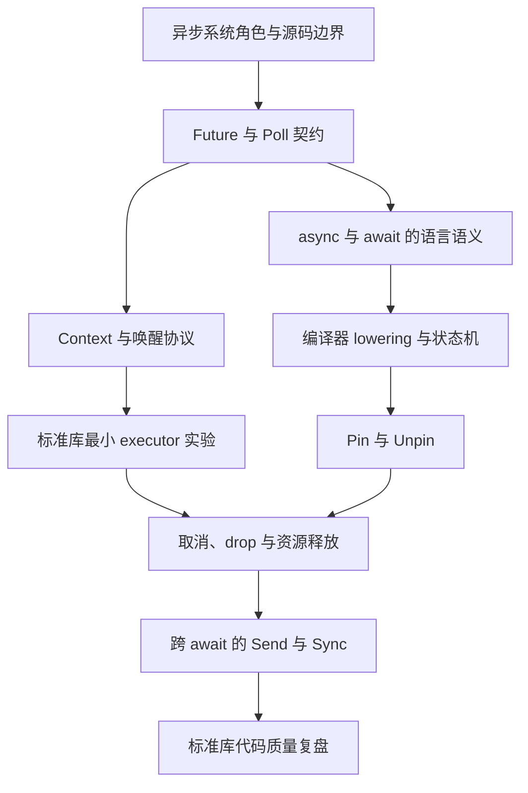

# 路线图

本文档是项目阶段与进度的唯一事实来源。详细结论放入 `docs/src/`，可运行的证据放入 `labs/`。

## 阶段 0：仓库基础

- [x] 初始化根 Git 仓库并关联远程仓库。
- [x] 创建虚拟 Cargo workspace，跟踪共享 lockfile，并固定根工具链。
- [x] 添加 Agent 约束与源码阅读方法。
- [x] 建立文档语言和 Git/PR 协作规范。
- [x] 建立文档、证据、代码设计与小步变更的工程质量约束。
- [x] 建立单本 mdBook 的最小结构与有序阅读入口。
- [x] 记录开发工具版本与首批上游源码基线。
- [x] 添加上游源码 checkout 自动化脚本。
- [x] 添加研究资料收件箱、目录和摘要模板。
- [x] 添加 PR template，将变更等级、范围、证据和验收检查固化到提交流程。
- [x] 建立 Markdown、拼写、链接、mdBook 和 Mermaid 渲染检查。
- [x] 建立可复现的本地全量检查入口，并与 PR 必需检查保持同步。
- [ ] 添加第一个标准库异步实验 package。
- [ ] 基于第一个真实 package 建立 rustdoc warning、doctest、格式化、lint 和测试检查。

## 阶段 1：Rust 异步契约与编译器模型

本阶段闭合语言、标准库与必要编译器模型之间的边界；Tokio 调度和异步 I/O 留到阶段 2，自研可演进运行时留到阶段 4。
学习顺序允许暂时前向引用，但每个缺口都必须登记后续回收位置。

- [ ] 划清语言、标准库、编译器和运行时的职责，并根据固定 `rust-src` 建立相关模块地图。
- [ ] 研究 `Future` 与 `Poll` 的契约、状态和重复 poll 边界，并建立最小手动 poll 实验。
- [ ] 研究 `Context`、`Waker`、`RawWaker` 与 `Wake` 的进度协议、生命周期和安全不变量。
- [ ] 用标准库实现只服务于学习的最小 executor 实验，闭合 poll、park 和 wake 路径。
- [ ] 区分 `async`/`.await` 的公开语义、用于解释的近似脱糖和编译器实际生成的状态机。
- [ ] 使用单独固定的 nightly 工具链检查相关 HIR、THIR 和 MIR，并记录版本与命令。
- [ ] 研究 `Pin`、`Unpin`、地址稳定性和自引用状态之间的关系，并核验 Future poll 签名中的约束。
- [ ] 研究通过 drop Future 与资源产生的取消语义。
- [ ] 研究值跨越 `.await` 时对 `Send`/`Sync` 的影响。
- [ ] 对已研究的标准库源码完成第二遍代码质量复盘。

每个机制项完成时，都要闭合契约、可观察行为、固定实现、设计原因和工程取舍；独立问题按 [`docs/source-reading-method.md`](docs/source-reading-method.md) 动态拆分。

## 阶段 2：Tokio 与 Mio

- [ ] 固定 Tokio release 及其实际解析到的 Mio 基线版本。
- [ ] 为任务、spawn、调度、时间、I/O、同步、取消和关闭建立外部可观察实验。
- [ ] 建立 Tokio 公共 API 与运行时内部模块、关键 symbol 之间的映射。
- [ ] 研究 Mio 的 polling 模型、平台后端、注册、事件投递和 poller 唤醒。
- [ ] 从操作系统开始，追踪 readiness 如何经过 Mio 和 Tokio 最终唤醒任务 `Waker`。
- [ ] 对每个已研究的 Tokio/Mio 子系统完成第二遍代码质量复盘。

## 阶段 3：tiny-mio

- [ ] 确定并记录首个支持的平台范围；当前默认方案为 Linux 优先。
- [ ] 实现非阻塞 socket 与最小 epoll 封装。
- [ ] 实现 event、token、interest、registration 和 poller 唤醒。
- [ ] 定义安全性与生命周期不变量，为 unsafe 边界补充 `// SAFETY:` 证明并用 Miri 检查适用路径。
- [ ] 同时产出冻结的阶段实验和持续演进的 `tiny-mio` crate。

## 阶段 4：tiny-runtime

- [ ] 实现 `block_on`、任务表示、ready queue 和自定义唤醒。
- [ ] 实现 spawn 与 join handle。
- [ ] 实现 timer 与运行时时钟驱动。
- [ ] 通过 reactor/driver 将 `tiny-mio` readiness 连接到任务唤醒。
- [ ] 实现最小异步 TCP。
- [ ] 实现取消、资源清理和优雅关闭。
- [ ] 只有在理解并测试单线程不变量后，才添加多线程调度。
- [ ] 对原子状态和线程交错建立最小 Loom 模型，并明确模型未覆盖的范围。

## 阶段 5：配套 crate

- [ ] 重新评估 `tiny-macros`、`tiny-util`、`tiny-stream` 和 `tiny-test` 是否已经具备独立 crate 的必要性。
- [ ] 只创建已有具体使用场景支撑的配套 crate。

## 阶段 6：成对的异步最佳实践

- [ ] 在选择场景前建立能力矩阵。
- [ ] 每个场景分别使用惯用的 Tokio 和惯用的 `tiny-runtime` 实现一次。
- [ ] 对齐可观察契约和黑盒测试，但不使用通用抽象掩盖运行时差异。
- [ ] 对照固定的运行时版本与当前源码，验证历史研究资料中的相关结论。
- [ ] 记录取消点、所有权、背压、阻塞边界、关闭、测试和可观测性。

## 贯穿全程的代码质量学习线

对于每个重要的标准库、Tokio、Mio 或本项目子系统：

- [ ] 第一遍笔记解释正确性、不变量、状态和失败行为。
- [ ] 第二遍笔记解释 API 与模块设计取舍。
- [ ] 至少在一个聚焦实验中验证一种设计模式，或者明确记录拒绝它的理由。
- [ ] 自研实现记录哪些设计沿用上游，哪些设计有意与上游不同。
- [ ] 所有性能或优雅性结论都由证据支撑，而不是来自项目声誉。
