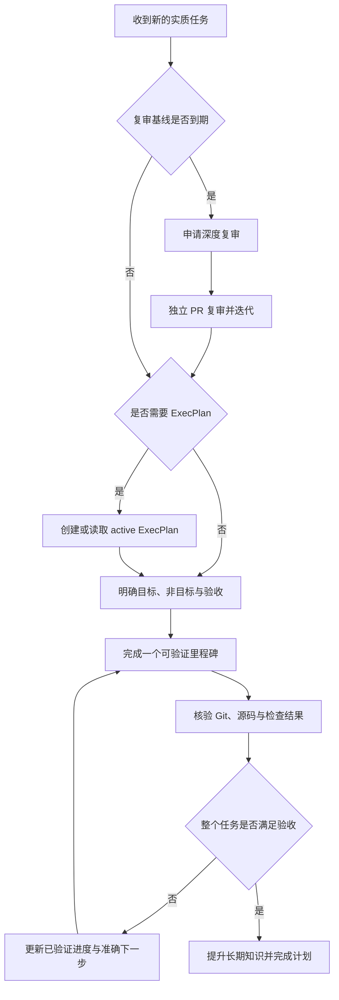

# Agent 长任务工作流

本文档定义如何让长期任务跨越上下文压缩、会话切换、agent 更换和机器迁移后仍可准确恢复。
目标不是延长单个对话，而是让任意会话都可以被替换，并让新 agent 仅依靠仓库中的版本化事实继续工作。

这里采用 `agent workflow` 作为名称，因为它只表示广义 agent harness 的仓库与流程层，不包括模型调用循环、工具路由、sandbox 和 orchestrator 等运行组件。

## 稳定内核与可替换增强层

模型、上下文管理和 agent 产品会持续变化，因此只把不依赖某个模型缺陷的原则放入稳定内核。

| 层次 | 当前内容 | 变更原则 |
| --- | --- | --- |
| 稳定内核 | 仓库事实源、明确验收、可恢复计划、Git 与测试核验、人工批准 | 只有项目目标或证据标准变化时调整 |
| 可替换增强层 | context reset、skill、hook、独立 evaluator、worktree、定时提醒和 orchestrator | 由实际失败或测量证明收益；失去收益时删除 |

新增增强机制前必须写明它正在解决的已观察问题、成本和移除条件，模型或工具升级后也不默认保留针对旧行为建立的脚手架。

## 事实源

同一结论发生冲突时，按照以下顺序核验，并修正较低层的记录：

| 时间范围 | 事实源 | 负责的问题 |
| --- | --- | --- |
| 项目 | 源码、测试、`ROADMAP.md`、正式文档和 ADR | 当前实现、已接受知识、阶段与持久决定 |
| 复杂任务 | active ExecPlan | 目标、里程碑、已验证进度、风险与下一步 |
| 单个变更 | Git diff、commit、PR 正文和检查结果 | 本次实际变更与验收证据 |
| 会话 | task、goal、task list、memory 和对话摘要 | 当前工具中的临时工作上下文 |

源码、Git 状态和可重复验证优先于计划中的文字声明。
产品 memory、对话 transcript 和本机 task list 可以帮助定位，但不得承载跨机器必须保留的唯一信息。

`ROADMAP.md` 只记录项目阶段和完成状态，ExecPlan 只协调一个复杂任务，ADR 只记录持久且难以撤销的决定，因此不要创建全局 `HANDOFF.md`、无限增长的进度日志或第二份路线图。

## 开始任务前的复审门禁

每个新的实质性研究、设计或实现任务开始前，agent 必须先读取 [`BASELINES.md`](BASELINES.md) 的 `last-reviewed` 和 `review-interval-days`。
到达复审日期后，agent 必须在原任务发生实质变更前说明已经到期，并申请先执行一次深度复审。
获得同意后，复审与必要迭代使用独立分支和 PR；完成后再恢复原任务。
只有用户可以明确要求暂缓，暂缓不能改写 `last-reviewed`，agent 仍应在后续新任务开始时再次报告到期状态。

定时自动化只能提醒复审到期，不能自动把新文章转化为项目规范，也不能自动合并变更。
详细来源边界、完成条件和复审记录见 [`BASELINES.md`](BASELINES.md)。

## 任务与会话边界

整个 tiny-async-lab 是一个长期项目，不是一个永久会话。

- 一个 task 服务一个清晰结果；通常接近一个 PR，但多 PR 任务可以由同一 ExecPlan 连接。
- 目标、约束和主要工作流仍然一致时，可以恢复原 task。
- 目标改变、失败路径严重污染上下文、需要独立评审或当前产品无法可靠恢复原会话时，开启新 task。
- 开启新 task 不代表重新规划项目；新 task 通过 active ExecPlan、Git 和正式文档恢复。
- 并行任务只有在工作范围互不覆盖或使用隔离 worktree 时才可以同时写入。

## 工作流

### 启动

1. 检查复审门禁。
2. 检查当前目录、分支、`git status` 和相关最近提交。
3. 读取 `AGENTS.md`、与任务直接相关的正式文档，以及明确指定的 active ExecPlan。
4. 核对目标、非目标、验收条件和当前里程碑。
5. 运行能够证明现有基线未损坏的最小检查。

不知道 active plan 路径时，只列出 `plans/active/` 中的文件名再选择，不批量加载所有计划。

### 执行与暂停

一次只推进一个能够独立验证的里程碑。
计划中的进度只记录已经观察到的事实，并附实际命令、结果、diff、commit、PR 或其他可定位证据。

暂停前更新以下内容：

- 已经完成的可观察结果；
- 实际运行的验证及结果；
- 未解决风险和发现；
- 当前工作树是否干净；
- 下一步要查看的路径、执行的命令或解决的具体问题。

### 恢复

恢复时不直接相信对话摘要或计划中的完成声明。

1. 重新检查目录、分支、`git status` 和相关 Git 历史。
2. 读取 active ExecPlan 和它链接的最小必要上下文。
3. 检查当前 diff、源码和生成该状态的证据。
4. 运行最小安全基线检查。
5. 调和计划与现实；冲突时先修正计划，再继续一个里程碑。

### 完成

只有全部验收条件具有证据时才能宣布任务完成。
完成时把长期结论提升到对应正式文档、rustdoc 或 ADR，把项目阶段结果更新到 `ROADMAP.md`，并按照 [`PLANS.md`](PLANS.md) 完成 active plan。

## 跨机器恢复

ExecPlan 解决知识连续性，Git 解决工作成果连续性，两者不能互相替代。
未提交的工作树不会随仓库迁移；切换机器前应由用户提交并推送阶段性成果，或者推送分支并创建 Draft PR。

干净 clone 的恢复演练至少应证明：

- 能根据已跟踪文件识别任务目标、已完成内容和下一步；
- 能通过 `make tools`、`make upstream` 和相关命令恢复环境；
- 不需要原对话、产品 memory 或某台机器的未跟踪文件；
- 不会因为计划声称完成而跳过源码和测试核验。

## 验收这套工作流

第一个真实复杂任务应执行冷启动演练：新 agent 不获得原会话，只获得仓库和 active plan，并需要准确说明目标、非目标、完成证据、剩余工作、下一步和风险。
后续出现恢复错误、范围漂移、错误宣布完成或维护成本过高时，把它记录为可复现失败，再决定修改稳定内核还是增删增强层。
