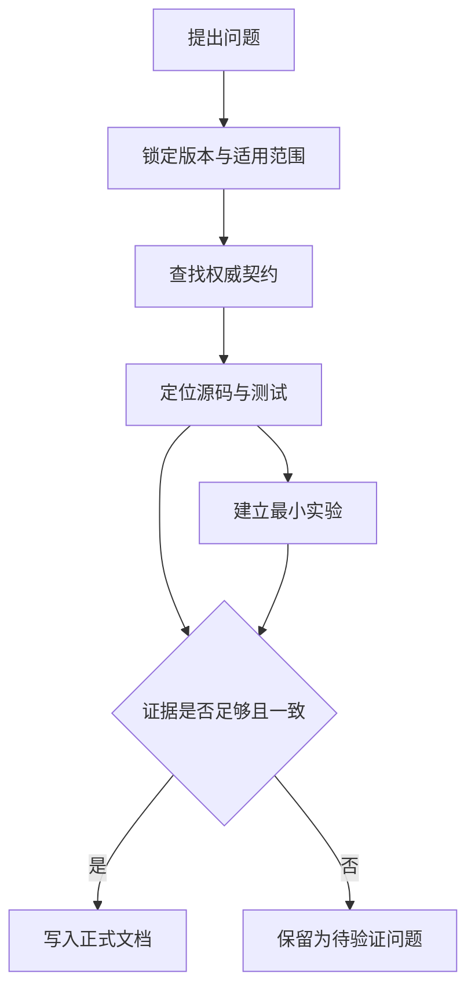
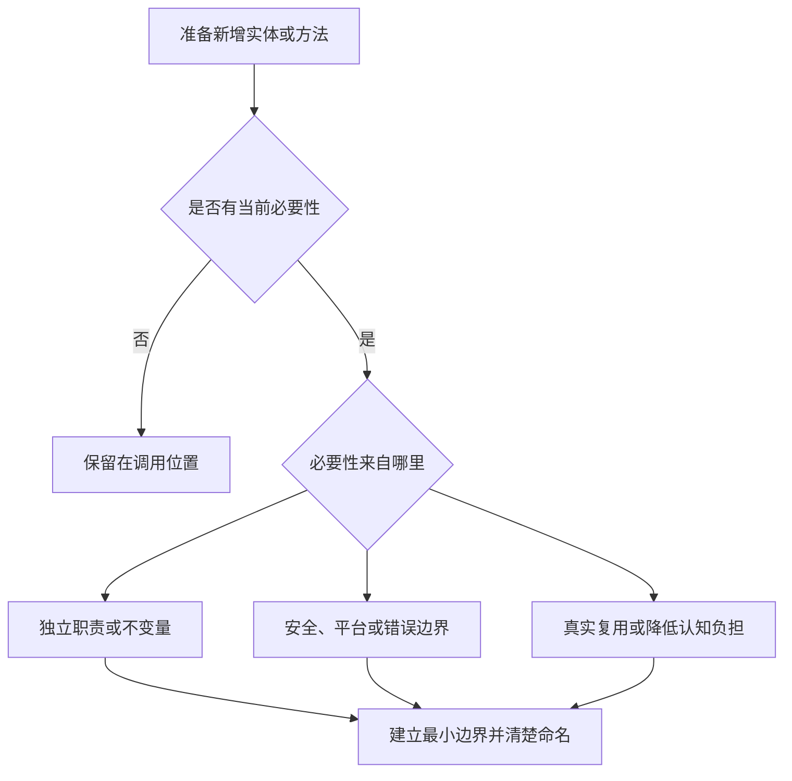

# 工程质量约束

本文档约束本项目的知识产出、文档、代码设计和变更规模。目标不是追求“短”或“抽象少”本身，而是在证据充分的前提下，用最小必要复杂度获得清晰、正确、可维护的结果。

## 基本原则

1. **先证实，再下结论**：正式文档只记录已由权威契约、固定版本源码或可复现实验支持的结论。
2. **简洁但不省略认知台阶**：不假设读者已经理解 Rust 异步；必要前置知识在首次出现时解释清楚，但不重复铺陈。
3. **让抽象证明自己的必要性**：每个 module、type、trait 和 function 都应承载明确价值。
4. **小步设计和实现**：只设计当前可验证的下一步，大目标拆成单一、可 review 的 PR。
5. **优先使用标准库**：除非学习目标正是实现某个机制，否则不重复实现标准库已经正确表达的能力。

## 文档标准

### 默认格式

- 项目文档默认使用 Markdown；只有 Markdown 无法有效表达内容时才引入其他格式。
- 一个文档回答一个主要问题，一个 section 承担一个明确职责。
- 开头直接说明问题、适用版本或范围，以及读完后应获得的结论。
- 使用短段落；并列信息使用列表，精确映射或对比使用表格，关系、状态和时序使用图。
- 删除客套话、重复结论、无证据的评价以及不能帮助理解或决策的背景。
- 发现结构不再合适时直接重构原文，不创建 `final-v2`、`new` 等平行版本。

### 渐进式解释

文档按照“结论与地图 → 必要概念 → 机制与证据 → 边界与例外”的顺序展开：

1. 先让读者知道正在解决什么问题，以及各部分之间的关系。
2. 术语第一次出现时解释它是什么、为什么存在，以及与当前问题的关系。
3. 机制说明必须覆盖状态、所有权、进度来源、失败路径和取消行为；不能只描述成功路径。
4. 深入细节放在相关结论之后，不用尚未解释的术语解释另一个新术语。
5. 同一概念只保留一处权威解释，其他文档通过链接引用。

“简洁”衡量的是无效信息少，而不是字数少。删掉必要解释会降低信息效率，而不是提高信息密度。

### Mermaid 图

当图比连续文字更快揭示关系时，优先使用 Mermaid：

| 要表达的信息 | 优先图形 |
| --- | --- |
| 控制流、数据流、因果关系 | `flowchart` |
| 多个参与者之间的调用与唤醒顺序 | `sequenceDiagram` |
| Future、任务或资源的状态转换 | `stateDiagram-v2` |
| 模块、类型与依赖关系 | `classDiagram` 或 `flowchart` |
| 阶段演进与事件顺序 | `timeline` 或 `gitGraph` |

每张图必须满足以下条件：

- 回答一个明确问题，不作为装饰；
- 使用完成任务所需的最少节点，过大的图按阅读目的拆分；
- 节点名称与正文术语一致，箭头语义明确；
- 正文说明图中最重要的不变量或结论，不能让图独自承担精确契约；
- 提交前确认 Mermaid 能够正确渲染。

### 代码与输出片段

- 示例保留证明当前结论所需的最少代码，但必须能够独立理解；需要运行时提供完整命令和环境。
- 优先引用可运行的 `labs/`，避免在多个文档复制逐渐失真的长代码。
- 输出只保留与结论有关的部分，并明确标注省略内容；不要用截图代替可搜索文本。

## 证据标准

不同结论需要不同类型的主要证据：

| 结论类型 | 主要证据 |
| --- | --- |
| Rust 语言与标准库的公开语义 | 当前 Rust Reference、标准库 API 文档与官方测试 |
| Tokio/Mio 公共行为 | 固定版本的公共 API 文档和契约测试 |
| 某个版本如何实现 | 固定 commit 的源码、内部注释与测试 |
| 功能设计与历史原因 | RFC、设计文档、tracking issue、PR、commit 历史或维护者说明 |
| 实际运行行为 | 记录工具链、平台、feature 和步骤的可复现实验 |
| 第三方文章或历史调研 | 仅作为线索，验证后才能成为项目结论 |

源码能够证明固定版本的实现路径，但不能自动证明公共 API 永远承诺该行为，也不能单独证明作者的设计动机。文档、源码和实验出现差异时，应先记录适用版本与冲突，继续调查，而不是选择一个看起来合理的解释。

每份机制研究至少记录：

```text
证据类型：公共契约 / 当前实现 / 设计原因 / 可复现实验
仓库与版本：repository + tag 或 commit
源码位置：path + symbol
适用条件：target + feature + toolchain
验证方式：test、lab 或官方文档链接
```

行号可以辅助定位，但不能代替 `path + symbol`，因为行号会随源码变化。引用必须尽量靠近它支持的结论。

证据进入正式文档前遵循以下流程：



待验证问题应回到契约、源码和实验继续调查。推测、经验印象和“看起来如此”不能改写成确定语气进入 `docs/`。如果需要做推导，必须明确标为推导，列出前提，并尽可能通过源码或实验再次验证。

## 代码设计标准

### 最小必要抽象

新增 module、type、trait、function 或通用参数前，至少应满足一项当前存在的需要：

- 表达一个独立领域概念或职责；
- 持有状态、生命周期或必须集中维护的不变量；
- 隔离 public API、策略与机制、平台差异、错误或 unsafe 边界；
- 已经存在真实复用，而不是猜测未来可能复用；
- 显著降低调用方的认知负担，或者形成有价值的独立测试边界。

如果一项也不满足，优先把逻辑留在使用位置。抽象是否值得存在由它隐藏或保护的复杂度决定，而不是单纯由代码行数或调用次数决定。



单次调用且逻辑简单的 helper 通常应内联；但如果它命名了重要领域操作、封装状态转换、隔离 unsafe 或错误边界，即使只有一个调用点也可能值得保留。反过来，不能为了减少实体数量，把两个职责和变化原因不同的模块合并成一个大模块。

### 标准库优先

实现基础能力前先检查 `core`、`alloc` 和 `std` 是否已有合适的类型、trait、collection、同步原语或所有权封装。使用标准库不是为了缩短代码而牺牲语义，而是优先复用经过验证、读者熟悉且能直接表达不变量的工具。

如果某一步的学习目标正是重新实现标准库或运行时机制，应明确记录：为什么不能直接复用、重新实现到哪一层为止，以及生产代码中通常会选择什么现成能力。

### 职责与可读性

- 保持高内聚、低耦合，让状态所有者、数据流和唤醒路径可追踪。
- 不为尚不存在的需求加入通用 trait、配置项、feature、extension point 或 companion crate。
- 优先让类型表达不变量；无法表达时使用紧邻代码的注释和断言。
- `unsafe` 只用于无法通过安全 Rust 表达且确有必要的边界，每一处都记录安全前提并提供针对性验证。
- 性能优化必须先说明目标与基线，再以 benchmark、profile 或可复现实验验证。

## 小步设计与实现

每个 PR 开始前，只需在 PR 正文中明确以下最小契约，不为小变更额外创建设计文档：

```text
目标：本次唯一要获得的可观察结果
不做：明确留给后续 PR 的内容
依据：契约、源码或实验入口
验收：能够证明完成的测试、实验或文档结果
```

大功能按照可验证的依赖顺序拆分。每一步都应能够独立解释、运行或测试，并为下一步建立必要能力；不要在第一个 PR 中预先搭出所有未来层次。

行数只是 review 成本的预警信号，不是质量指标：

- 手写 diff 以不超过约 400 行为目标；
- 超过 400 行时，PR 必须说明为何继续拆分会破坏理解或验证；
- 超过 800 行的手写 diff 原则上应在 review 前拆分；
- lockfile、生成文件和不可拆分的机械变更不计入预算，但应与逻辑变更隔离并明确标注。

一个较小 PR 如果同时引入多个概念或改变多个职责，仍然需要拆分。一个略大的 PR 如果只完成一个不可分割、证据完整的目标，也可以在说明理由后接受。

当学习步骤由用户手写时，Agent 应提供目标、约束、资料定位、测试思路和代码 review，不提前给出完整实现。只有用户明确要求代为实现时，Agent 才编写代码，并继续遵守相同的小步范围。

## 完成条件

一项研究、文档或实现只有同时满足以下条件才算完成：

- 目标与非目标明确，未顺手扩大范围；
- 技术结论有与其类型匹配的权威证据；
- 文档对新读者完整，同时没有重复和无效信息；
- 图表确实降低理解成本，并已验证能够渲染；
- 新增抽象有可说明的当前价值，且已检查标准库能力；
- 正确路径、失败路径和关键不变量有相称的测试或实验；
- diff 小到可以完成有效 review，验证命令及结果已经记录。
