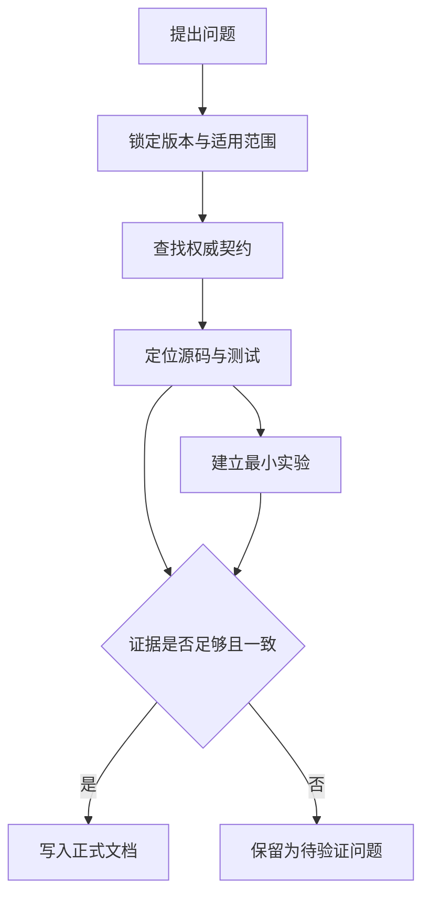
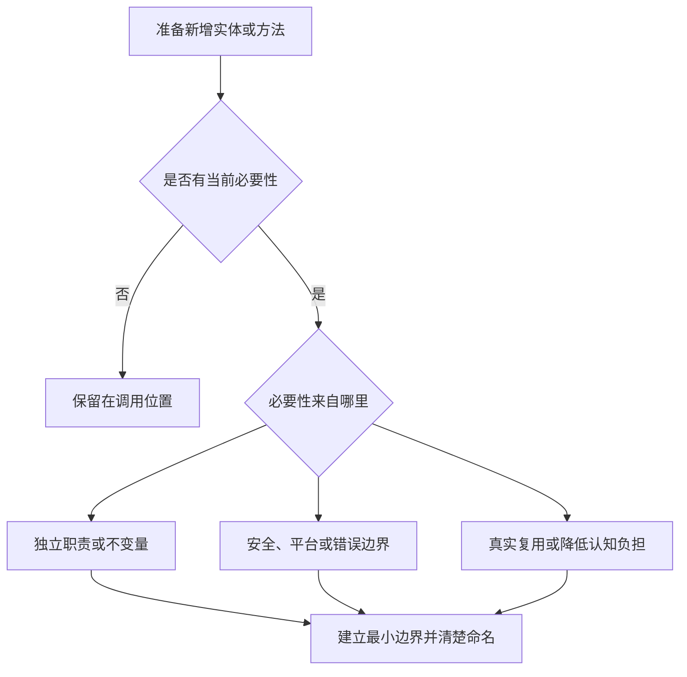

# 工程质量约束

本文档约束本项目的知识产出、文档、代码设计和变更规模。目标不是追求“短”或“抽象少”本身，而是在证据充分的前提下，用最小必要复杂度获得清晰、正确、可维护的结果。

## 基本原则

1. **先证实，再下结论**：正式文档只记录已由权威契约、固定版本源码或可复现实验支持的结论。
2. **简洁但不省略认知台阶**：不假设读者已经理解 Rust 异步；必要前置知识在首次出现时解释清楚，但不重复铺陈。
3. **让抽象证明自己的必要性**：每个 module、type、trait 和 function 都应承载明确价值。
4. **小步设计和实现**：只设计当前可验证的下一步，大目标拆成单一、可 review 的 PR。
5. **优先使用标准库**：除非学习目标正是实现某个机制，否则不重复实现标准库已经正确表达的能力。

## 文档标准

### 默认格式

- 项目文档默认使用 Markdown；只有 Markdown 无法有效表达内容时才引入其他格式。
- 一个文档回答一个主要问题，一个 section 承担一个明确职责。
- 开头直接说明问题、适用版本或范围，以及读完后应获得的结论。
- 使用短段落；并列信息使用列表，精确映射或对比使用表格，关系、状态和时序使用图。
- 新增或重写段落时，Markdown 源文件原则上一句一行，不按固定列宽强制换行；渲染后的同一段落仍保持连续。
- 删除客套话、重复结论、无证据的评价以及不能帮助理解或决策的背景。
- 发现结构不再合适时直接重构原文，不创建 `final-v2`、`new` 等平行版本。

一句一行用于降低文档 diff 的 review 成本，不意味着把一个完整论证切成大量孤立段落。
一句过长时应先改写句子，而不是依赖硬换行掩盖复杂表达。

### 文档职责与阅读路径

不同载体服务不同问题，不把学习教程、API 契约、实验记录和设计决策混在同一文档中：

| 载体 | 主要读者与职责 | 组织方式 |
| --- | --- | --- |
| `README.md`、`ROADMAP.md`、`CONTRIBUTING.md` | 第一次进入仓库的人和贡献者；说明项目地图、进度与协作入口 | 只保留稳定入口并链接详细规范 |
| `docs/src/` | 希望系统理解机制的学习者；作为单本 mdBook 的源文件，保存经过验证的权威解释 | 通过 `SUMMARY.md` 建立顺序，按问题和机制拆分章节 |
| `labs/` | 希望先观察行为再理解原理的学习者；保存可运行实验 | 示例优先，一个实验验证一个主要问题 |
| crate rustdoc | crate 使用者；定义公共 API 契约 | 从使用者视角说明能力、约束和示例 |
| `docs/adr/` | 后续维护者；记录持久且难以撤销的设计决策 | 只记录背景、决定、替代方案和后果 |
| `research/` | 调研者；保存尚未验证的材料和问题 | 明确版本、来源与验证状态，不作为项目结论 |

`docs/src/` 和 `labs/` 可以从不同方向解释同一主题，但不能复制两套会独立演化的完整结论。
正式机制解释只保留一个权威位置，实验和其他文档通过链接连接它。

### 渐进式解释

文档按照“结论与地图 → 必要概念 → 机制与证据 → 边界与例外”的顺序展开：

1. 先让读者知道正在解决什么问题，以及各部分之间的关系。
2. 把读者视为聪明且愿意学习、但尚不了解当前领域；术语第一次出现时解释它是什么、为什么存在，以及与当前问题的关系。
3. 机制说明必须覆盖状态、所有权、进度来源、失败路径和取消行为；不能只描述成功路径。
4. 深入细节放在相关结论之后，不用尚未解释的术语解释另一个新术语。
5. 同一概念只保留一处权威解释，其他文档通过链接引用。

引入重要概念时，应根据主题覆盖“是什么、为什么需要、如何观察或使用、限制和取舍”。
示例应当尽可能小，同时保留能够影响结论的真实约束；不能为了缩短代码而制造生产代码中不存在的假象。

“简洁”衡量的是无效信息少，而不是字数少。删掉必要解释会降低信息效率，而不是提高信息密度。

### 知识章节的设计与评审

新增或实质重写机制章节前，先在 active ExecPlan 或临时工作笔记中完成最小写作设计：一个主问题、从问题到结论的因果或概念依赖链、关键结论的证据与适用边界，以及三到五个用于核验理解的问题。
这些内容是写作者的脚手架，不是固定的正文模板；除非能直接帮助读者理解，否则不要把“学习目标”“误解清单”“证据地图”或验收问题机械复制进学习书。

解释性章节必须由主问题组织，而不是由已经收集到的术语、源码路径或资料顺序组织。
一个概念应在回答当前问题需要它时出现，并连接到读者已经获得的概念；如果一段内容开启了另一条可以独立验收的推理链，应移动、链接或拆分，而不是顺手插入。
源码目录、symbol 清单和 API 对照属于参考材料，可以放在推理完成后的附录或独立参考页，但不能代替机制解释。

正文中的段落、表格和图应至少承担一项职责：建立或修正概念，说明因果或状态关系，提供证据，限定结论，给出必要例子，或者连接后续验证路径。
删除后不影响上述任何一项的过程说明、自我评价、重复结论和泛泛过渡语应删除。
内部写作设计可以比正文更显式，最终文章应隐藏生产过程，只保留读者建立正确模型所需的信息。

机制章节定稿前分别执行两类评审：

1. 技术评审核对契约、版本、源码、实验、推导和适用边界，确认没有把历史动机、常见实现或近似模型写成当前保证。
2. 教学评审核对读者的前置知识、概念出现顺序和主推理链，确认图表回答明确问题，并确认仅依靠正文可以回答内部设置的理解问题。

先修正知识组织，再处理句式和排版；结构错误不能通过增加摘要、列表或更多文字弥补。
这套方法参考了 [Google Technical Writing 对受众、范围和文档组织的要求](https://developers.google.com/tech-writing/one/documents)、[Diátaxis 对 explanation 与 reference 的区分](https://diataxis.fr/explanation/)，以及 [Carnegie Mellon 对已有知识、知识组织和目标练习的学习原则](https://www.cmu.edu/teaching/principles/learning.html)。
外部写作方法只约束知识组织，不为本项目的 Rust 技术结论提供证据。

### 质量基线与反馈回写

已经通过评审的学习章节构成后续工作的质量校准样本，但不是固定模板。
新章节的篇幅、标题和图表应服从自身问题；与该问题有关的因果链、概念完整性、证据纪律和边界说明不得因追求更短或机械套用其他结构而退化。

章节完成必须同时满足技术评审、教学评审、指定人工评审和相应自动检查。
自动检查只能证明格式、链接、示例或图形等可机械验证的性质，不能证明解释正确、完整或易于建立心智模型；不能仅因 CI 通过就勾选路线图。

评审未通过时，立即恢复未完成状态，并在 active ExecPlan 中记录读者在哪条推理链、概念关系、证据边界或表达位置失去理解，再优先修正知识组织。
如果问题可能在后续章节重复出现，应把最小、可执行且高信噪比的规则回写到本规范或 `AGENTS.md`；不要把一次性的措辞偏好永久堆叠为通用约束。

### Mermaid 图

当图比连续文字更快揭示关系时，优先使用 Mermaid：

| 要表达的信息 | 优先图形 |
| --- | --- |
| 控制流、数据流、因果关系 | `flowchart` |
| 多个参与者之间的调用与唤醒顺序 | `sequenceDiagram` |
| Future、任务或资源的状态转换 | `stateDiagram-v2` |
| 模块、类型与依赖关系 | `classDiagram` 或 `flowchart` |
| 阶段演进与事件顺序 | `timeline` 或 `gitGraph` |

每张图必须满足以下条件：

- 回答一个明确问题，不作为装饰；
- 使用完成任务所需的最少节点，过大的图按阅读目的拆分；
- 节点名称与正文术语一致，箭头语义明确；
- 正文说明图中最重要的不变量或结论，不能让图独自承担精确契约；
- 提交前确认 Mermaid 能够正确渲染。

Mermaid 是 Markdown 文档中的默认图形格式。
只有其他渲染方式能够实质改善表达时才引入它，并保留可文本编辑的源文件、固定版本和可复现的生成方法；生成物必须与源文件明确区分。
语法、schema 或布局检查只能证明图能够生成，不能证明其中的技术关系正确；图中的结论仍须由相应契约、源码或实验支持。

### 代码与输出片段

- 示例保留证明当前结论所需的最少代码，但必须能够独立理解；需要运行时提供完整命令和环境。
- 优先引用可运行的 `labs/`，避免在多个文档复制逐渐失真的长代码。
- 输出只保留与结论有关的部分，并明确标注省略内容；不要用截图代替可搜索文本。

### 公共 API 文档

crate 根文档负责说明 crate 的用途、能力边界和一个真实的入门示例。
公共 API 文档从一句能够独立理解的摘要开始，不重复签名已经清楚表达的类型信息。
在适用时使用以下稳定 section：

- `# Examples`：展示为什么以及如何使用该 API；优先引用能够编译和运行的 doctest。
- `# Errors`：列出返回错误的条件和调用方可以依赖的语义。
- `# Panics`：列出可观察的 panic 条件，不能把它藏在实现细节中。
- `# Cancel safety`：说明 Future 在 `.await` 未完成时被 drop 后，已经发生的效果、是否可以安全重试以及资源如何释放。
- `# Safety`：为 unsafe API 列出调用方必须维持的全部不变量。

不是每个细小 API 都需要一段独立的大型示例。
示例应与理解成本和误用风险相称；多个 API 共同服务同一场景时，链接到一个权威示例，避免复制。
doctest 本身也是测试，但不能代替边界条件、并发交错和失败路径测试。

### 文档自动检查

文档约束应逐步落实为可执行检查，而不是长期依赖人工记忆：

- Markdown 格式和结构检查；
- 中文与英文术语的拼写检查，并维护项目词典；
- 内部链接和适用的外部链接检查；
- Mermaid 语法与渲染检查；
- rustdoc warning、文档链接和 doctest；
- 文档中引用的可运行实验。

自动检查必须有明确的信噪比。
不要为了“规则更多”整体启用会产生大量无关意见的检查集合；新增规则应先证明它能发现本项目真实问题。

## 证据标准

不同结论需要不同类型的主要证据：

| 结论类型 | 主要证据 |
| --- | --- |
| Rust 语言与标准库的公开语义 | 当前 Rust Reference、标准库 API 文档与官方测试 |
| Tokio/Mio 公共行为 | 固定版本的公共 API 文档和契约测试 |
| 某个版本如何实现 | 固定 commit 的源码、内部注释与测试 |
| 功能设计与历史原因 | RFC、设计文档、tracking issue、PR、commit 历史或维护者说明 |
| 实际运行行为 | 记录工具链、平台、feature 和步骤的可复现实验 |
| 第三方文章或历史调研 | 仅作为线索，验证后才能成为项目结论 |

源码能够证明固定版本的实现路径，但不能自动证明公共 API 永远承诺该行为，也不能单独证明作者的设计动机。文档、源码和实验出现差异时，应先记录适用版本与冲突，继续调查，而不是选择一个看起来合理的解释。

每份机制研究至少记录：

```text
证据类型：公共契约 / 当前实现 / 设计原因 / 可复现实验
仓库与版本：repository + tag 或 commit
源码位置：path + symbol
适用条件：target + feature + toolchain
验证方式：test、lab 或官方文档链接
```

行号可以辅助定位，但不能代替 `path + symbol`，因为行号会随源码变化。引用必须尽量靠近它支持的结论。

证据进入正式文档前遵循以下流程：



待验证问题应回到契约、源码和实验继续调查。推测、经验印象和“看起来如此”不能改写成确定语气进入 `docs/src/`。如果需要做推导，必须明确标为推导，列出前提，并尽可能通过源码或实验再次验证。

## 代码设计标准

### 最小必要抽象

新增 module、type、trait、function 或通用参数前，至少应满足一项当前存在的需要：

- 表达一个独立领域概念或职责；
- 持有状态、生命周期或必须集中维护的不变量；
- 隔离 public API、策略与机制、平台差异、错误或 unsafe 边界；
- 已经存在真实复用，而不是猜测未来可能复用；
- 显著降低调用方的认知负担，或者形成有价值的独立测试边界。

如果一项也不满足，优先把逻辑留在使用位置。抽象是否值得存在由它隐藏或保护的复杂度决定，而不是单纯由代码行数或调用次数决定。



单次调用且逻辑简单的 helper 通常应内联；但如果它命名了重要领域操作、封装状态转换、隔离 unsafe 或错误边界，即使只有一个调用点也可能值得保留。反过来，不能为了减少实体数量，把两个职责和变化原因不同的模块合并成一个大模块。

### 局部推理

代码应尽可能让读者只查看当前较小范围，就能确认前置条件、状态变化和结果用途：

- 把条件检查和依赖该条件的操作放在一起；不要让一个函数检查、另一个相距较远的函数假设检查已经发生。
- 优先用类型表达“已经验证”“已经注册”或“拥有该资源”等状态；无法表达时，让断言和安全说明紧邻依赖它的操作。
- 简单的单次逻辑优先使用有意义的局部变量或带注释的局部 block，避免为了外观整洁来回传递上下文参数。
- 不用 helper 隐藏关键的 `return`、`break`、重试、错误传播或状态转换；提取后必须让控制流更容易而不是更难追踪。
- 不创建只为构造后立即执行一个动作、却不持有有意义状态或不变量的 “doer object”。
- 文件按自上而下的阅读路径组织：公共入口和核心流程在前，辅助实现和低层细节在后。

局部性不是绝对规则。
当提取能够建立真正的测试边界、集中维护不变量、隔离平台或 unsafe 细节，或者明显改善 `?` 和提前返回的控制流时，可以保留单次 helper。

### 标准库优先

实现基础能力前先检查 `core`、`alloc` 和 `std` 是否已有合适的类型、trait、collection、同步原语或所有权封装。使用标准库不是为了缩短代码而牺牲语义，而是优先复用经过验证、读者熟悉且能直接表达不变量的工具。

如果某一步的学习目标正是重新实现标准库或运行时机制，应明确记录：为什么不能直接复用、重新实现到哪一层为止，以及生产代码中通常会选择什么现成能力。

### 公共 API 与依赖边界

公共 API、跨 crate 依赖和平台边界一旦被使用，就比私有实现更难撤销，因此需要更高的设计门槛：

- 先确认真实问题和调用场景，不从预想中的通用接口倒推需求。
- 优先使用能够表达语义的领域类型，避免用含义不清的 `bool`、裸元组或多层 `Option` 承载重要状态。
- 不为内部调用提前加入 `AsRef`、泛型参数、扩展 trait 或 builder；复杂度必须由当前调用场景证明。
- 新增外部 dependency 前说明标准库和现有依赖为什么不足，并评估维护状态、feature、平台、编译时间和安全边界。
- 不引入只提供少量容易直接表达的 helper 的微型 dependency。
- 公共 API 变更必须同步契约测试和 rustdoc，并明确稳定性、错误、取消与资源生命周期。

“标准库优先”并不意味着手工模仿标准库内部实现。
优先采用稳定公共能力；只有研究目标需要时才进入内部机制，并把学习实现与生产建议明确区分。

### 职责与可读性

- 保持高内聚、低耦合，让状态所有者、数据流和唤醒路径可追踪。
- 不为尚不存在的需求加入通用 trait、配置项、feature、extension point 或 companion crate。
- 优先让类型表达不变量；无法表达时使用紧邻代码的注释和断言。
- 性能优化必须先说明目标与基线，再以 benchmark、profile 或可复现实验验证。

### Unsafe 代码

`unsafe` 只用于安全 Rust 无法表达且当前目标确实需要的边界，并保持作用域尽可能小：

- 每个 unsafe block 前使用 `// SAFETY:` 说明当前操作为什么满足全部安全前提，不能只写“已经检查”。
- unsafe API 使用 `# Safety` 说明调用方必须维持的不变量。
- 即使位于 `unsafe fn` 内，也让具体 unsafe operation 显式可见；项目建立 crate 后启用并处理 `unsafe_op_in_unsafe_fn`。
- 将所有权、别名、有效性、对齐、初始化、线程和生命周期假设转化为类型、断言或针对性测试。
- 在 Miri 支持的执行路径上运行 Miri；涉及原子操作和线程交错时使用专门的并发模型测试。

`// SAFETY:` 记录的是可以被 review 的证明义务，而不是为 unsafe 代码提供形式上的免责说明。

### 异步与并发正确性

异步实现必须明确进度来源和生命周期，至少检查：

- Future 每个状态允许的输入、输出和状态转换；
- `Poll::Pending` 返回前如何保证未来可能再次被唤醒；
- wake、重复 wake、虚假 wake 和 wake 与 poll 并发时的行为；
- Future 被 drop 时，注册、队列项、I/O interest、timer 和拥有的资源如何清理；
- 取消后已经发生的部分效果，以及重试是否安全；
- 阻塞操作是否跨越异步执行边界，背压是否有明确传播路径；
- runtime shutdown 时任务、driver 和外部资源的终止顺序。

验证工具按照它能够回答的问题分层使用：

| 工具 | 主要回答的问题 | 不能替代 |
| --- | --- | --- |
| 单元与集成测试 | 已知输入下的行为、失败路径和公共契约 | 未枚举的线程交错 |
| doctest | 公共 API 示例是否可编译、基本用法是否保持有效 | 深层边界与并发测试 |
| Loom | 小模型内的原子操作和线程交错 | 模型外执行、完整正确性证明 |
| Miri | 被执行路径中的部分 undefined behavior | 未执行路径、真实网络和所有并发交错 |
| fuzz | 大量自动生成输入下的崩溃和不变量破坏 | 业务语义证明和穷尽状态空间 |
| benchmark/profile | 性能基线、回归和热点 | 正确性证明 |

只在相应风险存在时引入 Loom、Miri、fuzz 或 benchmark，并记录模型和工具限制。
“工具没有报错”不能改写成“实现已经被证明正确”。

### 性能实验与归因

性能工作先把“更快”改写成可证伪的假设，说明目标 workload、可观察契约、预期瓶颈、比较基线和可能牺牲的保证。

- 比较前先验证正确性和能力边界；取消、背压、公平性、清理、负载均衡或错误语义不等价时，必须把差异作为结果的一部分，而不能把更少的工作直接解释为优化。
- 专用运行时变体至少覆盖一个目标场景和一个暴露边界的非目标场景，并与固定版本的 Tokio 和通用 `tiny-runtime` 基线比较。
- benchmark 记录硬件、操作系统、工具链、依赖版本、构建参数、CPU 亲和性、负载模型、预热、样本与统计方法；能够影响结论的脚本和输入必须可复现。
- 指标由假设决定；吞吐、延迟分位数、CPU、内存、分配、系统调用、上下文切换、跨核迁移、cache miss、队列和 wake 行为只选择能够回答当前问题的部分。
- benchmark 证明特定环境中的性能现象，profile、trace 和计数器帮助定位相关路径；声称某项设计导致差异时，还需要源码控制流、逐项消融或等价的对照证据。
- 保留没有获得预期收益、只在狭窄条件下成立或引入明显退化的结果，并明确性能结论不能外推到未测 workload、平台和版本。

## 小步设计与实现

每个 PR 开始前，只需在 PR 正文中明确以下最小契约，不为小变更额外创建设计文档：

```text
目标：本次唯一要获得的可观察结果
不做：明确留给后续 PR 的内容
依据：契约、源码或实验入口
验收：能够证明完成的测试、实验或文档结果
```

大功能按照可验证的依赖顺序拆分。每一步都应能够独立解释、运行或测试，并为下一步建立必要能力；不要在第一个 PR 中预先搭出所有未来层次。

### 变更风险分级

PR 的设计与 review 强度首先由变更的可逆性、影响边界和证明难度决定，而不是由行数决定。
一个 PR 同时命中多个等级时，按照最高等级处理：

| 等级 | 典型变更 | 进入实现前 | Review 与验证重点 |
| --- | --- | --- | --- |
| L1：局部实现 | 单个组件内部实现，不改变 public API、持久不变量或依赖方向 | PR 最小契约即可 | 局部正确性、可读性和回归测试 |
| L2：契约与生命周期 | public API、错误语义、取消、资源生命周期、并发不变量或可观察行为 | 先写清契约、状态与替代方案，通常与无关重构分开 | 契约测试、失败路径、兼容性和文档 |
| L3：边界与架构 | 影响生产实现的新外部依赖、跨组件依赖方向、新平台或 unsafe abstraction、难以撤销的架构决定 | 先完成简短 ADR 或等价设计评审，再实现最小切片 | 依赖方向、安全证明、平台范围和长期后果 |

L3 不等于必须一次完成大型设计。
ADR 只决定当前必须稳定的边界，其余能力继续由后续小 PR 逐步证明。

### Diff 规模

行数只是 review 成本的预警信号，不是质量指标：

- 手写 diff 以不超过约 400 行为目标；
- 超过 400 行时，PR 必须说明为何继续拆分会破坏理解或验证；
- 超过 800 行的手写 diff 原则上应在 review 前拆分；
- lockfile、生成文件和不可拆分的机械变更不计入预算，但应与逻辑变更隔离并明确标注。

一个较小 PR 如果同时引入多个概念或改变多个职责，仍然需要拆分。一个略大的 PR 如果只完成一个不可分割、证据完整的目标，也可以在说明理由后接受。

纯格式化、重命名、代码移动和无行为变化的重构应尽可能与语义变化分开。
需要多个 commit 时，每个 commit 都应形成可独立理解的逻辑步骤；开发中的临时检查点应在 review 前整理。

当学习步骤由用户手写时，Agent 应提供目标、约束、资料定位、测试思路和代码 review，不提前给出完整实现。只有用户明确要求代为实现时，Agent 才编写代码，并继续遵守相同的小步范围。

## 完成条件

一项研究、文档或实现只有同时满足以下条件才算完成：

- 目标与非目标明确，未顺手扩大范围；
- 声明范围内不存在影响结论的未解释黑盒，暂缓问题已命名并登记回收位置；
- 技术结论有与其类型匹配的权威证据；
- 文档对新读者完整，同时没有重复和无效信息；
- 图表确实降低理解成本，并已验证能够渲染；
- 新增抽象有可说明的当前价值，且已检查标准库能力；
- public API 已记录适用的错误、panic、取消与 safety 契约；
- unsafe 代码具有紧邻的 `// SAFETY:` 证明，并接受与风险相称的检查；
- 正确路径、失败路径、取消、资源释放和关键并发不变量有相称的测试或实验；
- diff 小到可以完成有效 review，验证命令及结果已经记录。

## 规范来源与适配原则

本规范优先采用 Rust 项目自身维护的正式规则，并根据学习型异步运行时项目的目标进行适配：

- [rust-analyzer Style Guide](https://rust-analyzer.github.io/book/contributing/style.html)：局部推理、最小抽象、源码组织和变更边界。
- [Bevy Writing Docs](https://bevy.org/learn/contribute/helping-out/writing-docs/)：新读者模型、教程分层、简洁表达和可验证示例。
- [Rust API Guidelines](https://rust-lang.github.io/api-guidelines/checklist.html) 与 [rustdoc 写作指南](https://doc.rust-lang.org/rustdoc/how-to-write-documentation.html)：公共 API、crate 文档和 doctest。
- [rustc Coding Conventions](https://rustc-dev-guide.rust-lang.org/conventions.html) 与 [标准库 Safety Comments](https://std-dev-guide.rust-lang.org/policy/safety-comments.html)：原子变更、自动格式化和 unsafe 证明。
- [rustc-dev-guide](https://github.com/rust-lang/rustc-dev-guide)：Markdown 链接与 Mermaid 渲染的自动检查实践。
- [Tokio Pull Requests](https://github.com/tokio-rs/tokio/blob/master/docs/contributing/pull-requests.md) 与 [Tokio Reviewing](https://github.com/tokio-rs/tokio/blob/master/docs/contributing/reviewing-pull-requests.md)：异步库测试、review 优先级和增量改进。
- [Loom](https://github.com/tokio-rs/loom) 与 [Miri](https://github.com/rust-lang/miri)：并发交错和 undefined behavior 的针对性检查及其能力边界。
- [Cargo Design Principles](https://doc.crates.io/contrib/design.html)：简洁、分层和避免功能旋钮膨胀。

这些来源是依据，不是无需判断的规则集合。
本项目不复制特定项目的内部命名、数据结构和测试目录习惯，不设置 Mermaid 数量指标，也不整体启用 [Clippy](https://doc.rust-lang.org/clippy/usage.html) 的 `pedantic` 或 `restriction` lint。
任何新增约束都应说明它要防止的真实问题，并尽可能落实为高信噪比的自动检查。
