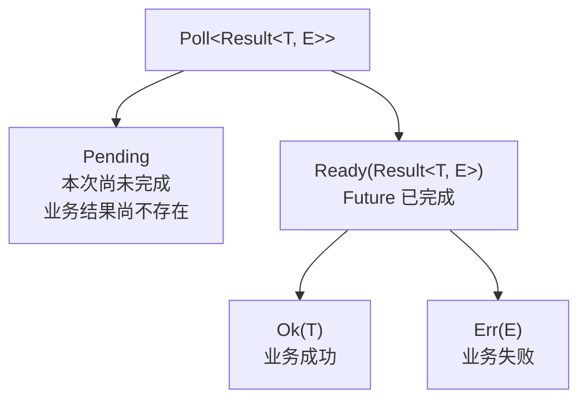

# Future 与 Poll 的调用契约

[上一章](system-boundaries.md)已经建立从 Future、task 到 poll/wake 的总体路径，[前一个实验关卡](future-poll-lab.md)则让首次 poll、`Pending`、外部条件改变和重新 poll 变成了可观察事件。
本章固定 Rust 1.91.1，回答每次调用 `Future::poll` 时签名中的各层约束、调用方与 Future 实现方的责任，以及 `Pending`、`Ready` 和完成后再次 poll 的边界。
阅读顺序先从内向外拆开完整签名，再建立单次调用的状态与进展契约；紧邻的[固定源码与 API 参考](future-poll-reference.md)在主线之后完整回收 `Poll` 和四个固定源码单元的其余公共表面。

核心结论是：`poll` 是调用方借用并固定 Future 后主动发起的一次完成尝试，`Poll<T>` 只报告这次尝试是否交付了输出，不是 Future 全部内部状态的公共枚举。

## 先从内向外读懂 `poll` 签名

Rust 1.91.1 的公共签名如下，代码中的中文注释是本书添加的语法导读，不是上游源码注释：

```rust
# use std::pin::Pin;
# use std::task::{Context, Poll};

pub trait Future {
    // 每个具体 Future 实现只选择一种完成输出类型，不能在每次 poll 时临时改变。
    type Output;

    fn poll(
        // `self:` 使参数成为 receiver，`Self` 是实现类型；外包 Pin 后不能简写成 `&mut self`。
        // `&mut Self` 独占借用 Future，允许修改跨 poll 状态并排除其他安全引用访问。
        // `&mut` 不要求每次都修改，按值消费的也只是 pinning reference 而非底层 Future。
        // 后续 poll 可以重新借出 reference；`Pin` 固定的是它指向的 Future，不是 reference 本身。
        // `Pin` 不表示堆分配、只读或 Future 从创建时就位于特殊内存区域。
        self: Pin<&mut Self>,
        // `cx` 借来本次 task context，Future 不拥有 Context 或其中的 Waker。
        // 外层 `&mut` 是对 Context 的独占借用，父 Future 可以把它 reborrow 给子 Future。
        // `'_` 是待推断的 Context 内部 lifetime，不是 `'static`、Future lifetime 或“不重要”。
        // 这里的 `mut` 属于 reference type；写成 `mut cx` 才表示 parameter binding 可重新绑定。
        cx: &mut Context<'_>,
        // 外层 Poll 只报告本次尝试，只有 Ready 才携带固定的 Self::Output。
        // 输入 borrow 的 lifetime 没有出现在返回类型中。
    ) -> Poll<Self::Output>;
}
```

把省略的 lifetime 写出名字后，两个参数分别是 `Pin<&'future mut Self>` 和 `&'call mut Context<'waker>`；`'future`、`'call` 与 `'waker` 约束三段不同的 borrow，原签名没有要求它们相同。
[`Rust Reference` 的 lifetime elision 规则](https://doc.rust-lang.org/1.91.1/reference/lifetime-elision.html#lifetime-elision-in-functions)规定每个被省略的输入 lifetime 独立形成参数，而 `'_` 也按同一规则推断。

### 为什么 `&mut Self` 外面还需要 `Pin`

单独使用 `&mut Self` 仍不足以保护地址，因为安全代码可以通过 `mem::replace`、`mem::swap` 等操作把值移出可变引用指向的位置。
[`Pin<Ptr>` 的固定契约](https://doc.rust-lang.org/1.91.1/core/pin/struct.Pin.html)包装的是 pointer `Ptr`，并约束 pointer 的 pointee 不能再被安全地移动或在原地址失效，除非 pointee 类型实现 `Unpin`。

[`Pin` 的固定源码说明](https://github.com/rust-lang/rust/blob/ed61e7d7e242494fb7057f2657300d9e77bb4fcb/library/core/src/pin.rs)指出，编译器为 `async fn` 生成的 Future 可能在开始推进后形成依赖自身地址的关系，因此统一的 `Future` trait 必须允许这类地址敏感实现安全参与 poll。
调用方在第一次 poll 之前就提供 `Pin`，使实现从第一次可能建立地址关系的调用开始便能够依赖“之后不再移动”这一承诺。

如果具体 Future 实现 `Unpin`，这个类型声明自己不依赖 pinning 所保护的地址关系，`Pin<&mut F>` 对它的访问限制便可以安全解除。
如果具体 Future 不实现 `Unpin`，实现者需要使用安全 projection API 或承担相应 unsafe 证明才能取得 pinned 字段的可变访问，调用方不能把它当作普通 `&mut F` 移出。
本章只依赖这项最小操作含义；自引用为什么可能出现、projection、drop guarantee 与 `Unpin` 的完整证明属于后续 `PINNING` 机制单元。

### 为什么当前 API 使用 `&mut Context<'_>`

Rust 1.91.1 的 stable [`Context::waker(&self)`](https://doc.rust-lang.org/1.91.1/core/task/struct.Context.html#method.waker)返回当前 task 的 `&Waker`，而[固定源码](https://github.com/rust-lang/rust/blob/ed61e7d7e242494fb7057f2657300d9e77bb4fcb/library/core/src/task/wake.rs)让 `Context<'waker>` 的参数约束这次内部借用至少在 `'waker` 内有效。

stable 的 `Context::waker(&self)` 当前只需要共享访问，但[稳定化前的官方讨论](https://github.com/rust-lang/rust/issues/59113#issuecomment-471774554)把“为可变、可能不具备 `Send`/`Sync` 的 task-local context 保留扩展空间”列为选择 `&mut Context` 的理由。
固定 Rust 1.91.1 源码中的 `Context::ext(&mut self)` 仍是 unstable 实验，它只能证明这个版本已在 unstable API 中探索该扩展空间，不能反过来宣称 stable `Context` 已保证任意扩展数据。

代码中所示的 reborrow 不会为每层 Future 创建不同 task 或不同 Waker。
如果子 Future 返回 `Pending` 后还需要通知当前 task，它通常克隆 `cx.waker()` 并把拥有的 `Waker` 交给共享状态或 driver 保存，而不能把这次短暂借入的 `&mut Context` 当作自身长期状态。

### 返回类型还留下两条边界

这只解除输出与本次 `self`、`cx` borrow 之间的绑定；`Output` 仍可以包含具体 Future 类型自身携带的其他 lifetime。

[`Future`](https://doc.rust-lang.org/1.91.1/core/future/trait.Future.html)和 [`Poll`](https://doc.rust-lang.org/1.91.1/core/task/enum.Poll.html)都带有 `#[must_use]`，因为创建 Future 后不 poll，以及丢弃一个可能为 `Pending` 的返回值，都会悄悄丢失协议要求处理的工作。
`poll` 本身是安全方法，所以即使调用方违反完成后不再 poll 的上层契约，具体实现也不能借此造成 undefined behavior。

## 一次 `poll` 是一次有边界的完成尝试

[`Future::poll` 的公共契约](https://doc.rust-lang.org/1.91.1/core/future/trait.Future.html#tymethod.poll)补上签名无法表达的动态责任：实现尝试产生最终输出，并在当前尚不能完成时连接后续唤醒。

这里的“调用方”是直接执行本次 `poll` 的那一层，不只指 executor：

```text
executor
└── poll(task 的根 Future, cx)
    └── 父 Future 在 `.await` 处 poll(子 Future, cx)
```

task 是 runtime 安排执行和唤醒的单位，根 Future 是这项 task 最外层的计算；父 Future 则是在自己的 `poll` 中推进子 Future，并把同一个 task context reborrow 下去。
手动实验也可以直接扮演调用方；无论调用发生在哪一层，Future 都不会因为作为一个值存在就自动获得一次 poll，而 `.await` 本身也不会创建新 task。

`poll` 应尽快返回且不应阻塞，这是让同一执行线程继续推进其他工作所需的运行特征，但不是保证具体完成时限的期限承诺。
一次调用可以推进零步、一步或许多内部步骤，只要它在尚未交付最终输出时遵守 `Pending` 的通知责任并及时把控制权交还调用方。

## `Poll` 不是 Future 的状态机

[`Poll<T>`](https://doc.rust-lang.org/1.91.1/core/task/enum.Poll.html)的两个变体只回答本次是否取得输出；与真正跨调用存活的状态并排后，边界更清楚：

| 层次 | 保存什么 | 谁可以改变它 |
| --- | --- | --- |
| Future 内部状态 | 控制流位置、子 Future、中间结果或实现定义的完成标记 | 具体 Future 的实现 |
| 外部进展状态 | socket、timer、channel、另一 task 的结果或实验中的共享条件 | 对应资源、driver 或生产方 |
| `Poll<T>` | 一次调用当前是否取得最终输出 | Future 在返回时构造，调用方随后消费 |

因此，不能因为连续两次得到 `Pending` 就断言 Future 内部没有变化，也不能因为某个实验使用 `Waiting -> Ready -> Completed` 就把这三个状态套到所有 Future 上。
`Poll` 即使被复制、比较，或在下一页经 `map` 等 API 转换，也仍只是已经返回的一个普通值，不会因此接管原 Future 的生命周期。

## 第一次与后续 poll 分别由谁触发

[Rust Reference 对 async function 的规定](https://doc.rust-lang.org/1.91.1/reference/items/functions.html#async-functions)与 [`.await` 的公开效果](https://doc.rust-lang.org/1.91.1/reference/expressions/await-expr.html#expr.await.effects)共同给出一次计算的正常调用顺序：

| 时点 | 谁采取动作 | 能够依赖的结果 |
| --- | --- | --- |
| 调用 `async fn` | 普通 Rust 调用方 | 得到 Future，函数体尚未开始 |
| 首次 poll | executor、父 Future 或手动驱动者 | 函数体开始推进，本次可能 `Pending` 或 `Ready` |
| `Pending` 后条件改变 | 资源、driver 或其他生产方 | 通知当前 task 值得再次 poll，不直接替调用方执行 poll |
| 重新 poll | task 再次获得执行机会后，由调用链主动发起 | 继续推进，仍可能 `Pending`，也可能 `Ready` |
| 得到 `Ready(output)` | 当前 poll 调用方 | 取得最终输出，并停止 poll 这个 Future |

这项惰性执行保证只适用于 async function 和相应语言构造，不能外推成“任意 Future 构造函数都不做同步工作”。
普通函数完全可以先执行同步逻辑再返回一个手写 Future，传给 `future::ready(value)` 的 `value` 也已经在调用前完成求值。

`.await` 在同一条调用链中先经 `IntoFuture` 取得子 Future，遇到 `Pending` 就让外围 async context 也返回 `Pending`，直到外围 Future 再次被 poll 后才继续子 Future。
`.await` 不会为这个子 Future 创建独立 task，也不会让 Waker 直接跳回 `.await` 后面的代码。

## `Pending` 是一次未完成的交接

`Pending` 只表示“这次 poll 没有交付 `Output`”。
它不表示 Future 尚未开始、不表示执行线程被阻塞、不表示发生了错误，也不保证下一次 poll 一定 `Ready` 或这个 Future 最终一定完成。

`Pending` 之后的责任可以按情形对齐：

| 情形 | Future、资源或生产方 | poll 调用方 |
| --- | --- | --- |
| 当前未完成但以后可能进展 | Future 把条件变化连接回当前 task，通常由自身、共享状态或 driver 保存最近一次 `Context` 提供的 Waker | 不紧循环 poll，而是把执行权交还 executor |
| 权威条件发生变化 | 具体实现按其同步协议更新状态并调用 Waker | task 再次可运行后才沿调用链重新 poll |
| 已经收到 wake | Waker 只提供一次新的 poll 机会，不直接执行 Future | 不能假设下一次 poll 必然 `Ready` |
| 调用方不再关心输出 | 无需再为这个调用方制造进展 | 可以停止安排 poll 并 drop Future；部分效果与清理留给取消语义 |

固定 [`Pending<T>`](https://github.com/rust-lang/rust/blob/ed61e7d7e242494fb7057f2657300d9e77bb4fcb/library/core/src/future/pending.rs)展示了“以后可能进展”这一前提为何必要；下面省略 attributes、rustdoc 和无关 impl，并把 imports 改为 `std` 以参加 mdBook 编译测试：

```rust
# use std::future::Future;
# use std::marker::PhantomData;
# use std::pin::Pin;
# use std::task::{Context, Poll};

pub struct Pending<T> {
    _data: PhantomData<fn() -> T>, // 记录 Output 类型但不保存 T，也没有可变成 Ready 的状态。
}

impl<T> Future for Pending<T> {
    type Output = T;

    fn poll(self: Pin<&mut Self>, _: &mut Context<'_>) -> Poll<T> {
        // 没有未来进展条件，所以它忽略 Context 并始终返回 Pending。
        Poll::Pending
    }
}
```

这个实现无须安排 wake，但不能证明普通等待型 Future 可以遗漏 wake。
条件检查、Waker 登记与并发事件之间如何避免 lost wake，以及 Waker 身份和生命周期如何保持安全，将在下一机制单元核验。

## `Ready` 表示 Future 完成，不保证业务成功

`Ready(output)` 表示这个 Future 已经交付其最终 `Output`。
`Poll` 没有单独的错误变体，业务失败只能由 `Output` 自己的类型表达。

[RFC 2592](https://rust-lang.github.io/rfcs/2592-futures.html#rationale-drawbacks-and-alternatives-for-removing-built-in-errors)把错误处理从核心 Future 协议中移除，因为“是否已经产生输出”和“输出如何表达业务失败”是可以正交组合的问题。
这让 async function 像普通 function 一样自行选择返回普通值、`Result` 或其他类型，而不是让所有 Future 都承担一种固定错误模型。

对应的嵌套关系如下：



## 完成后再次 poll 越过了调用契约

一旦某次调用返回 `Ready`，正常调用方就应停止 poll 这个 Future，并在不再需要它时将其 drop。
如果调用方错误地再次 poll，[`Future::poll` 的 `Panics` 小节](https://doc.rust-lang.org/1.91.1/core/future/trait.Future.html#panics)允许具体实现 panic、永久阻塞、再次返回某个值或产生其他普通行为。
trait 唯一保留的底线来自 `poll` 是安全方法：无论 Future 当前处于什么状态，这次错误调用都不得导致 undefined behavior。

下面的固定 [`Ready<T>`](https://github.com/rust-lang/rust/blob/ed61e7d7e242494fb7057f2657300d9e77bb4fcb/library/core/src/future/ready.rs)节选省略 attributes、rustdoc 和无关 impl，并把 imports 改为 `std` 以参加 mdBook 编译测试：

```rust
# use std::future::Future;
# use std::pin::Pin;
# use std::task::{Context, Poll};

pub struct Ready<T>(Option<T>); // `ready(value)` 从 `Some(T)` 开始；`None` 表示已经交付。

// 没有把 T 声明为 pinned field，所以 Ready<T> 无条件 Unpin，poll 可以修改内部 Option。
impl<T> Unpin for Ready<T> {}

impl<T> Future for Ready<T> {
    type Output = T;

    fn poll(mut self: Pin<&mut Self>, _cx: &mut Context<'_>) -> Poll<T> {
        // `mut self` 只让 binding 可变；`take` 同时完成 `Some(T) -> None` 并取出 T。
        // 第二次 poll 会在 `None` 上 panic；`_cx` 表明该实现不读取本次 Context。
        Poll::Ready(self.0.take().expect("`Ready` polled after completion"))
    }
}
```

前一实验中的 `RepeatReady` 则在每次 poll 时返回同一个静态值。
这项差异只能证明 trait 没有统一规定错误重复 poll 的普通结果；实验与固定实现都不能代表所有 Future。
