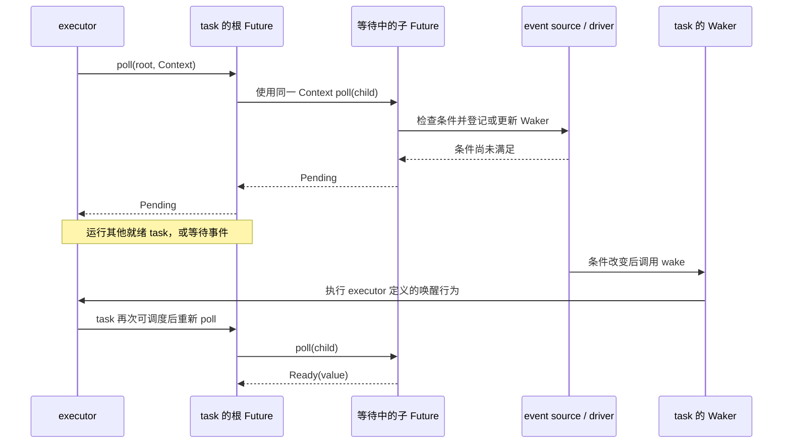
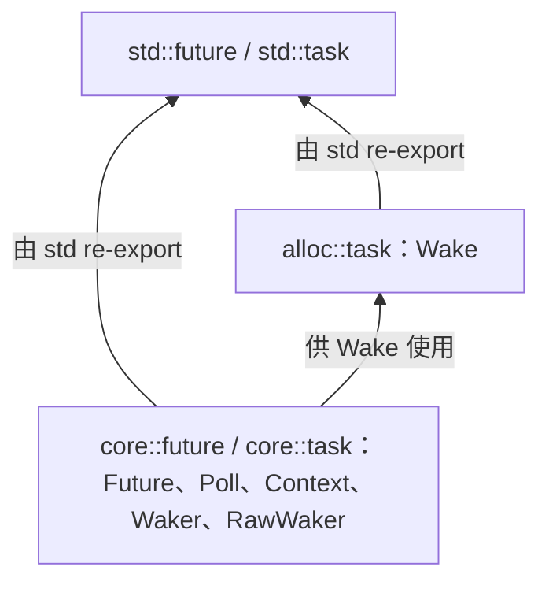

# Rust 异步如何暂停与恢复

Rust 异步的核心不是让代码在后台自动执行，而是让当前无法继续的计算保存状态、交还执行线程，并在进展条件改变后再次获得执行机会。
本章沿着这条进展路径解释 `async`、Future、task、`poll`、`Waker` 和 runtime 如何衔接，并划清 Rust 1.91.1 中语言、编译器、标准库与 runtime 的职责。

## 从等待时不占住线程开始

同步调用等待网络数据时，即使 CPU 暂时没有可为该调用执行的工作，当前线程也不能继续运行这个调用后面的代码。
操作系统可以转去运行其他线程，但如果每个并发操作都长期占用一个线程，程序就要为这些线程承担栈空间、调度和上下文切换成本。

异步程序选择另一种协作方式：操作当前不能完成时快速暂停自己的计算，让执行该计算的线程先运行其他可推进工作，条件改变后再回来继续。
[Rust Book 对 CPU-bound 与 I/O-bound 工作的区分](https://doc.rust-lang.org/1.91.1/book/ch17-00-async-await.html)说明了这里真正可利用的是等待时间，而不是 `async` 关键字本身创造了更多 CPU。

线程与 async 因此是互补工具，而不是新旧替代关系。
当任务很少、几乎不等待，或者主要工作是 CPU 计算时，引入 async 可能只有额外复杂度；[Tokio 的适用边界](https://tokio.rs/tokio/tutorial#when-not-to-use-tokio)也明确把大量等待 I/O 的并发任务与纯 CPU 并行、单次请求等场景区分开来。

## 暂停的计算必须保存自己的状态

[Rust Reference 对 async function 的定义](https://doc.rust-lang.org/1.91.1/reference/items/functions.html#async-functions)规定，调用 `async fn` 会把已经求值的参数捕获进一个匿名 Future，但不会立即执行函数体。
第一次 poll 这个 Future 时，函数体才开始运行；后续执行到 `.await` 时，只有被等待的 Future 返回 `Pending` 才会真的暂停，如果它已经 `Ready`，外围计算可以在同一次 poll 中继续。

恢复所需的控制流位置、局部状态，以及对外部数据和子 Future 的必要持有关系，都必须由返回的 Future 表示，否则下一次执行无从继续。
可以把编译器生成的 Future 理解为一台状态机：创建时处于初始状态，每次 poll 尝试转换状态，遇到尚未满足的等待条件就保存现场并返回，完成时产生最终值。

“状态机”是解释语义的模型，不是对具体 enum 形态、字段顺序或内存布局的承诺。
语言规定调用和暂停的可观察行为，编译器负责生成满足这些行为的匿名类型与恢复逻辑，具体 lowering 和布局仍是编译器实现细节。

这也解释了为什么 Future 不是 thread：Future 是保存异步计算状态的 Rust 值，它既不会自行取得 CPU，也不决定自己在哪条 OS thread 上运行。

## `poll` 是推进 Future 的入口

标准库把 runtime 与任意 Future 之间的最小协议压缩为一个方法：

```rust
use std::pin::Pin;
use std::task::{Context, Poll};

pub trait Future {
    type Output;

    fn poll(self: Pin<&mut Self>, cx: &mut Context<'_>) -> Poll<Self::Output>;
}
```

[Rust 1.91.1 的 `Future` 契约](https://doc.rust-lang.org/1.91.1/core/future/trait.Future.html)把一次 `poll` 定义为一次完成尝试：`Ready(output)` 交付最终值，`Pending` 表示本次还不能完成。
`poll` 路径应快速返回且不应阻塞，因为一条执行线程可能还负责推进许多其他 Future；`Pin` 为什么出现在接收者中将在专门章节解释。

Future 本身是惰性的，必须由外部主动 poll 才能通过这套协议获得进展。
通常是 executor 选择一个可运行 task，并用该 task 的 `Context` poll 它持有的根 Future。
第一次 poll 通常由 `block_on` 开始执行或 `spawn` 把新 task 放入就绪队列触发，Waker 主要解决 Future 已返回 `Pending` 后何时值得再次 poll。

“Future 惰性”不表示整个系统的任何工作都必须由这个 Future 的 poll 亲自完成。
如果一个 Future 只是接收另一 task 的计算结果，另一 task 可以独立推进，但当前 Future 仍要被重新 poll 才能观察结果并完成自己的状态转换。

## `.await` 组合 Future，不创建 task

[`.await` 的语言语义](https://doc.rust-lang.org/1.91.1/reference/expressions/await-expr.html)是先把操作数转换成 Future，再用外围 async context 当前获得的 `Context` poll 它。
子 Future 返回 `Ready(value)` 时，`.await` 得到 `value` 并继续执行；子 Future 返回 `Pending` 时，外围 async 计算也暂停，并把 `Pending` 沿调用链返回给最外层的 poll 发起者。

因此，一个根 Future 可以由许多相互嵌套的子 Future 组成，而 executor 通常只需要调度持有根 Future 的 task。
`.await` 只组合计算，不会自动创建独立 task、OS thread 或并行执行；创建独立 task 需要 runtime 的 `spawn` 等额外操作。

| 概念 | 在本书中的含义 | 不应混淆为 |
| --- | --- | --- |
| Future | 保存一个可能尚未完成的计算及其状态的值 | 已经在后台运行的任务 |
| task | runtime 管理的可调度工作单元，通常包含根 Future 和调度状态 | 每个被 `.await` 的子 Future |
| OS thread | 实际执行 Rust 指令、由操作系统调度的执行资源 | `async` 调用或 task 的固定一对一载体 |

这里的 task 是 runtime 层的逻辑概念，不是标准库承诺的某个 `Task` struct。
一个最小 `block_on` 甚至可以只反复推进一个根 Future，而不显式分配独立 task 对象；完整 runtime 才通常需要任务身份、生命周期和就绪队列。

## `Pending` 如何连接到下一次 `poll`

如果 executor 在 Future 返回 `Pending` 后立刻紧循环 poll，它只会反复得到同一结果并浪费 CPU。
poll/wake 协议改为让等待方登记“何时值得再试”的通知能力，executor 则可以运行其他 task，或者在没有可运行工作时等待外部事件。

以下时序以等待外部事件的子 Future 为例：



`Context` 携带当前 task 的 `Waker`，返回 `Pending` 的 Future 路径必须安排在可能继续推进时唤醒这个 task，并在后续 poll 使用了不同 Waker 时更新登记。
真正保存 Waker 的可能是最内层 Future、runtime 的 I/O driver、timer 或共享状态，而不是编译器生成的每一层 Future 都各存一份。

`Waker::wake` 表达“这个 task 值得再次 poll”，但不保证调用者会在 `wake` 返回前、同一 thread 或原调用栈上从 `.await` 后继续执行。
[标准库的 `Waker` 契约](https://doc.rust-lang.org/1.91.1/core/task/struct.Waker.html#method.wake)保证，在 executor 仍运行且 task 未结束的前提下，每次 wake 之后至少会有一次该 task 的 poll，但多次 wake 可以合并到同一次 poll，何时运行和在哪条 thread 上运行仍由 executor 决定。

这条协议只承诺新的尝试机会，不承诺下一次 poll 一定得到 `Ready`，也不承诺唤醒会把执行权公平地交给其他 task。
Waker 登记与条件检查如何避免丢失唤醒、多个 wake 如何合并以及 task 生命周期如何保持安全，将在唤醒协议章节逐项核验。

## 为什么采用 poll/wake 协议

一种自然的替代方案是让异步操作完成时直接调用 continuation callback，把结果主动推给后续计算。
Rust futures 的早期设计确实探索过这种模型，但在 `join` 等组合操作中，多个子操作需要共享“最后一个完成者调用”的 continuation，异构事件源还要长期保存不同类型的 callback，因而容易引入分配、引用计数、同步和动态派发。

[Aaron Turon 对 Future 设计过程的记录](https://aturon.github.io/blog/2016/09/07/futures-design/)解释了这次控制权反转：Future 不再保存完成回调，而是把子 Future 和中间结果保存为自身状态，由外部按需 poll；task 则成为事件发生后稳定的重新调度目标。
[RFC 2592](https://rust-lang.github.io/rfcs/2592-futures.html#rationale-drawbacks-and-alternatives)在稳定标准库协议时记录了 callback 方案在 Rust 中的分配、取消和组合代价，因此这里引用的不是对现有 API 的事后猜测。

poll/wake 描述的是 Future 与执行者如何交换“结果”和“再次尝试通知”，并不强制底层 I/O 采用 readiness 模型。
readiness、completion、timer、channel 或另一 task 的完成都可以在条件改变时调用 Waker；它们的资源语义和性能取舍属于 driver 与具体 Future 实现。

[Without Boats 对 async Rust 的回顾](https://without.boats/blog/why-async-rust/)进一步把 Future 模型放回 Rust 的设计脉络：暂停状态作为普通值保存，较小状态机可以像外部迭代器一样组合，runtime 也无需成为语言强制的全局设施。
这篇回顾用于理解设计者陈述的历史与取舍，现行语义仍以前述 Reference、API 文档和已接受 RFC 为准。

## 标准库固定协议，runtime 决定策略

`async`/`.await` 是语言能力，所以编译器生成的匿名类型必须实现一个稳定、所有库都能共享的 `Future` trait；这正是 [RFC 2592 对 Future 进入标准库的核心理由](https://rust-lang.github.io/rfcs/2592-futures.html#why-futures-in-std)。
同一 RFC 明确不定义 executor，只定义 executor、task 与 Future 之间请求再次调度的互操作协议。

这种边界是有意的历史选择。
[RFC 2394](https://rust-lang.github.io/rfcs/2394-async_await.html#motivation)记录了 Rust 1.0 前曾内置 green-thread runtime，但它会影响所有 Rust 程序，因而被认为过于强制；稳定的 async 设计改为由语言和标准库固定最小协议，由库选择执行、调度和 I/O 策略。

| 层次 | 对整条进展路径负责的部分 | 明确不由它决定的部分 |
| --- | --- | --- |
| Rust 语言 | `async fn`、async block、`.await` 的公开语义与类型规则 | task API、线程数量、调度和 I/O 模型 |
| 编译器 | 生成匿名 Future 与暂停后恢复所需的控制流 | 运行时选择哪个 task、等待哪个 OS 事件 |
| `core` / `alloc` / `std` | `Future`、`Poll`、`Context`、`Waker`、`RawWaker` 与 `Wake` 的互操作协议 | 通用 executor、就绪队列、异步 socket、timer 和 shutdown 策略 |
| async runtime | 管理 task，主动 poll 根 Future，并按需连接调度、I/O、timer、阻塞工作与关闭流程 | 改写语言语义或放宽 Future/Waker 公共契约 |
| 操作系统 | 调度 OS thread，并提供 readiness、completion、timer 等平台事件机制 | 理解 Rust Future、task 或 Waker |

runtime 内部的名称没有语言级强制边界，本书先采用下列工作定义：

| 名称 | 本书中的职责 |
| --- | --- |
| executor | 执行可运行 task，并调用其根 Future 的 `poll` |
| scheduler | 决定哪个可运行 task 先执行、在哪条 thread 上执行以及何时让出 |
| driver | 等待和分发 I/O、timer 等外部进展事件；只处理 readiness 的实现也常称 reactor |
| runtime | 组合 task 生命周期、executor、scheduler、driver 和面向用户的 API |

具体项目可以把 executor 与 scheduler 写在同一模块，也可以有多个 driver，因此这些名称帮助讨论职责，不要求实现必须拆成同名实体。
单 Future 的 `block_on` 只需把一个根 Future 推进到完成，Tokio 一类通用 runtime 则需要多任务、多线程、I/O、时间和关闭管理；两者都遵守同一套 Future/poll/wake 协议。

## 在固定标准库源码中复查协议

本项目固定 Rust 1.91.1、commit `ed61e7d7e242494fb7057f2657300d9e77bb4fcb`，标准库源码按能力而不是按“是否异步”统一放在一个模块中：



| 需要复查的协议 | 固定源码入口 | 入口说明 |
| --- | --- | --- |
| `Future` | [`library/core/src/future/future.rs::Future`](https://github.com/rust-lang/rust/blob/ed61e7d7e242494fb7057f2657300d9e77bb4fcb/library/core/src/future/future.rs) | `poll` 签名、Pending 后的唤醒责任和运行特征 |
| `IntoFuture` | [`library/core/src/future/into_future.rs::IntoFuture`](https://github.com/rust-lang/rust/blob/ed61e7d7e242494fb7057f2657300d9e77bb4fcb/library/core/src/future/into_future.rs) | `.await` 操作数转换为 Future 的公共入口 |
| `Poll` | [`library/core/src/task/poll.rs::Poll`](https://github.com/rust-lang/rust/blob/ed61e7d7e242494fb7057f2657300d9e77bb4fcb/library/core/src/task/poll.rs) | 一次 poll 已完成或仍待推进的结果 |
| `Context` 与底层唤醒类型 | [`library/core/src/task/wake.rs`](https://github.com/rust-lang/rust/blob/ed61e7d7e242494fb7057f2657300d9e77bb4fcb/library/core/src/task/wake.rs) | 当前 task 的 Waker，以及 executor 自定义唤醒行为的安全边界 |
| `Wake` | [`library/alloc/src/task.rs::Wake`](https://github.com/rust-lang/rust/blob/ed61e7d7e242494fb7057f2657300d9e77bb4fcb/library/alloc/src/task.rs) | 使用 `Arc` 安全构造 Waker 的常用入口，要求平台支持 pointer atomic |
| `std` re-export | [`library/std/src/lib.rs`](https://github.com/rust-lang/rust/blob/ed61e7d7e242494fb7057f2657300d9e77bb4fcb/library/std/src/lib.rs) | `std::future` 来自 `core`，`std::task` 汇合 `core::task` 与 `alloc::task` |

安装项目固定工具链与 `rust-src` 后，可以用 `rustc --print sysroot` 找到工具链根目录，再进入 `lib/rustlib/src/rust/library` 复查这些文件。
固定源码还包含 `LocalWaker`、`ContextBuilder` 和 `AsyncDrop` 等 unstable 项，因此“源码中存在”只能证明该 commit 含有实现，公共可用性还必须核对 stability 标记与 Rust 1.91.1 API 文档。

## 本章停在哪里

整条基础路径现在可以连成一句话：调用 `async fn` 得到保存计算状态的 Future，runtime 把根 Future 作为 task 推进，`.await` 在同一 poll 链中推进子 Future，`Pending` 把线程交还给 executor，条件改变后 Waker 使 task 获得新的 poll 机会。

这条路径仍留下三个需要分别证明的问题：`Future::poll` 在首次、重复与完成后调用时的完整契约，Waker 登记、合并与生命周期的不变量，以及 compiler lowering 与 `Pin` 如何安全保存跨暂停点状态。
Future 被 drop 后已经发生的效果、资源如何清理以及操作能否安全重试属于取消语义，也不能仅从“Future 惰性”推断。
后续章节将用固定源码和最小实验逐个闭合这些问题，而不会把本章的状态机近似或 runtime 术语当成尚未验证的实现事实。
